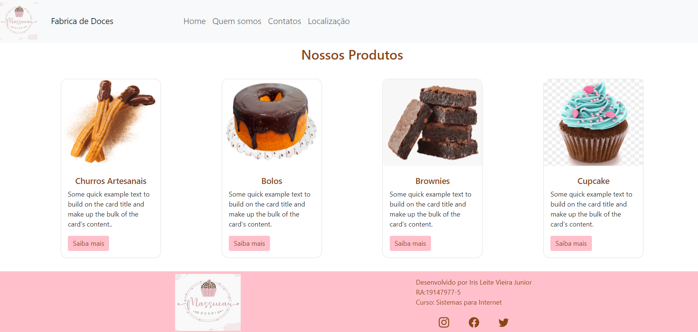
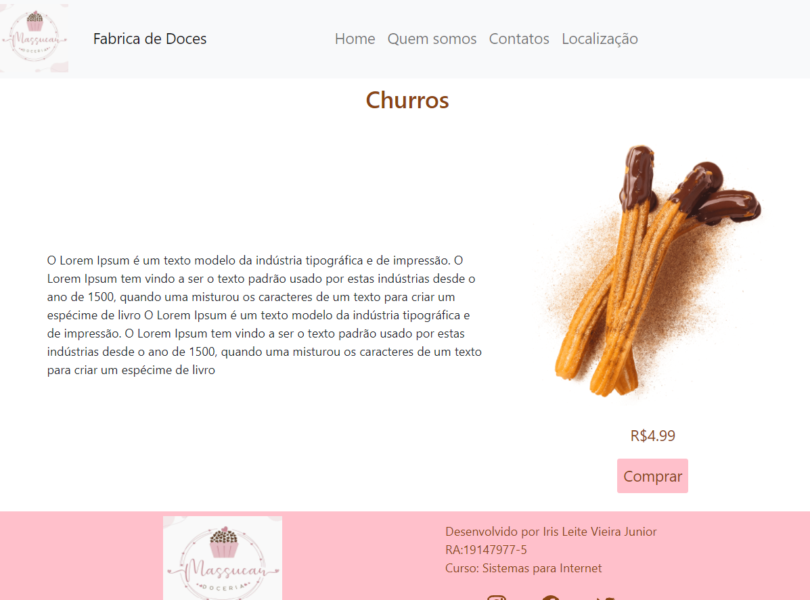
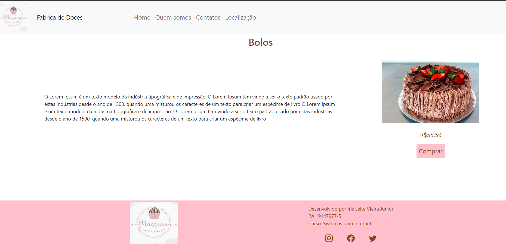

# 19147977-5_IrisJunior

### Atividade mapa do curso backend I

## 📦 Tecnologias utilizadas para construção:
- HTML5 -  Como linguagem de marcação.
- CSS3  -  Para estilização de todos os componentes.
- Bootstrap 5.
- PHP
  
## Preview do projeto





## 📋 Pré-requisitos
- ter instalado  [Google Chrome](https://www.google.com/intl/pt-BR/chrome) e [Git](https://git-scm.com/downloads).
- Instalar o [PHP](https://www.php.net/)
- Um servidor web. neste projeto foi utilizado o pacote [xampp](https://www.apachefriends.org/pt_br/index.html)
- Instale o [Gitbash](https://git-scm.com/downloads)

## Como rodar o projeto
Abra o terminal Git Bash no diretorio xampp/htdocs e cole o seguinte comando:
```
git clone https://github.com/Irisjunior/19147977-5_IrisJunior.git
```
